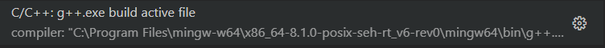

# C++ Folder

## How To Build/Compile
1. Ensure that you have all the prerequisites installed: (https://code.visualstudio.com/docs/languages/cpp)

2. Open the file in VSC and Use Cntrl + F9 and select "C/C++: g++.exe build active file"

3. A exe file will be created with the same name as your file of choice; run it via command line (e.x. >Arithmetic.exe)

## Extra Info
* The topics I followed were based on those given by [w3schools](https://www.w3schools.com/cpp/default.asp)

